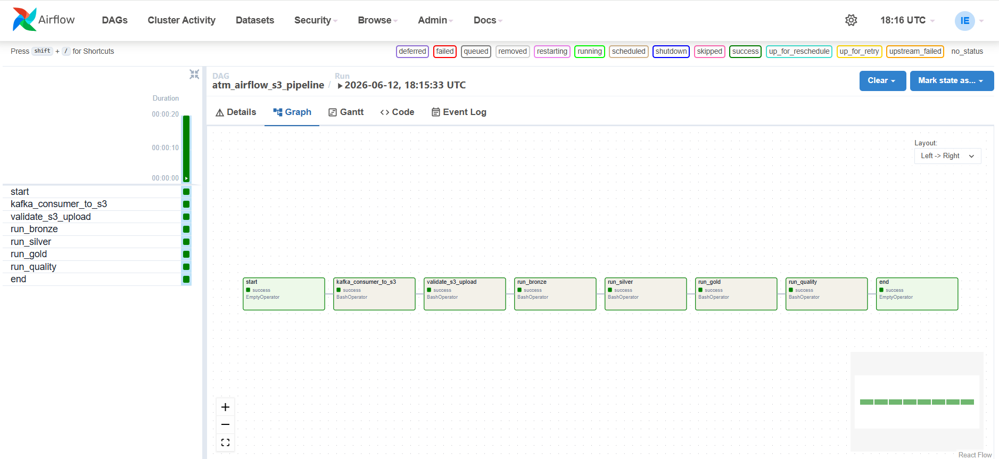
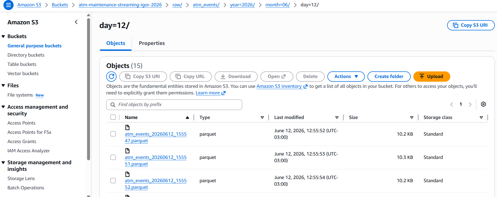
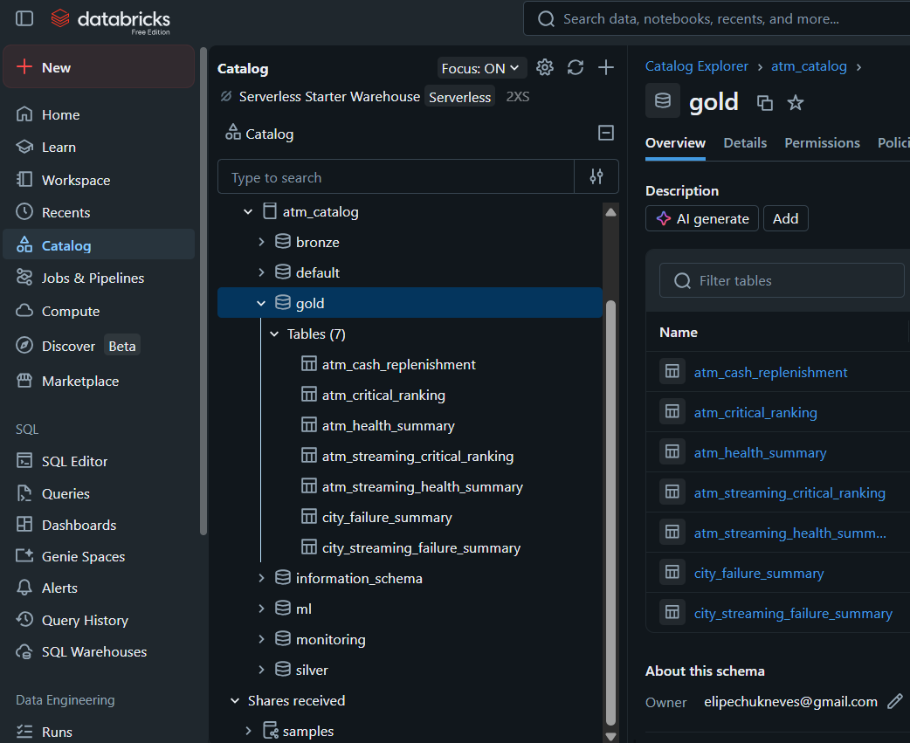
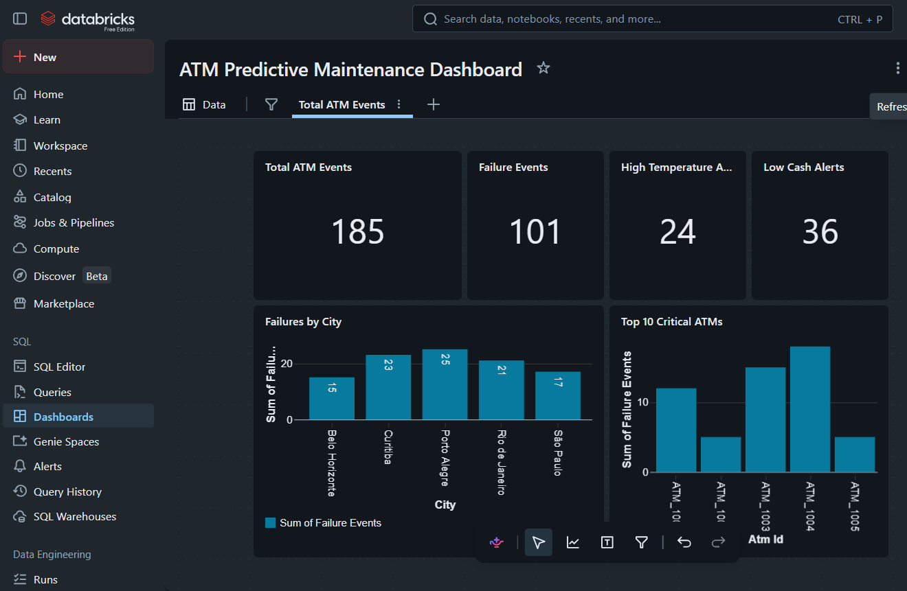

# ATM Predictive Maintenance Platform


## Project Overview

Real-Time Data Engineering Platform for ATM monitoring and predictive maintenance.

This project simulates an enterprise-grade streaming architecture using Apache Kafka, Apache Airflow, AWS S3, Databricks, Delta Lake and PySpark.

The platform ingests ATM telemetry events in real time, stores them in AWS S3, orchestrates data processing with Airflow and generates business-ready analytics using the Medallion Architecture (Bronze, Silver and Gold).

---

## Architecture

```text
ATM Telemetry Producer
          │
          ▼
     Apache Kafka
          │
          ▼
    Kafka Consumer
          │
          ▼
       AWS S3
     (Raw Events)
          │
          ▼
   Apache Airflow
  (Orchestration)
          │
          ▼
 Databricks Bronze
          │
          ▼
 Databricks Silver
          │
          ▼
  Databricks Gold
          │
          ▼
 Operational Dashboard
```

---

## Technology Stack

- Python
- Apache Kafka
- Apache Airflow
- AWS S3
- Databricks
- PySpark
- Delta Lake
- SQL
- Docker

---

## Project Structure

```text
atm-predictive-maintenance-platform
│
├── airflow/
│   ├── dags/
│   │   └── atm_airflow_s3_pipeline.py
│   └── docker-compose.yml
│
├── consumer/
│   └── 02_kafka_to_s3.py
│
├── producer/
│   └── atm_producer.py
│
├── datalake/
│
├── notebooks/
│   ├── 01_bronze_ingestion.py
│   ├── 02_silver_transformations.py
│   ├── 03_gold_kpis.py
│   └── 04_dashboard_queries.sql
│
├── docs/
│   ├── airflow_pipeline.md
│   ├── dashboard.md
│   ├── gold_tables.md
│   ├── s3_ingestion.md
│   └── images/
│
├── infra/
│   └── docker-compose.yml
│
├── requirements.txt
├── .env.example
├── .gitignore
└── README.md
```

---

## Data Pipeline

### Bronze Layer

Raw ATM telemetry events ingested from AWS S3.

Main objectives:

- Raw event storage
- Historical persistence
- Auditability

---

### Silver Layer

Data cleansing and enrichment.

Main transformations:

- Null handling
- Data standardization
- Business rule validation
- Event enrichment

---

### Gold Layer

Business-ready analytical datasets.

Generated tables:

- atm_health_summary
- atm_critical_ranking
- city_failure_summary
- atm_cash_replenishment

---

## Airflow Orchestration

The DAG automates the complete pipeline execution.

### Workflow

1. Kafka Consumer → AWS S3
2. S3 Validation
3. Bronze Processing
4. Silver Transformation
5. Gold KPI Generation
6. Data Quality Validation

Pipeline Status:

✅ Successful Execution

---

## Dashboard KPIs

Operational metrics generated from Gold tables:

- Total ATM Events
- Failure Events
- High Temperature Alerts
- Low Cash Alerts
- Failures by City
- Top Critical ATMs

---

## Project Results

The platform successfully demonstrates:

- Real-time ATM event ingestion
- Kafka streaming architecture
- Automated orchestration with Airflow
- Cloud storage using AWS S3
- Lakehouse processing with Databricks
- Bronze, Silver and Gold layers
- Data quality validation
- Operational dashboard visualization

Generated Metrics:

- 185 ATM Events
- 101 Failure Events
- 24 High Temperature Alerts
- 36 Low Cash Alerts

---

## Screenshots

### Airflow DAG



---

### AWS S3 Raw Layer



---

### Gold Analytics Tables



---

### Operational Dashboard



---

## Documentation

Additional documentation is available in:

- docs/airflow_pipeline.md
- docs/s3_ingestion.md
- docs/gold_tables.md
- docs/dashboard.md

---

## Key Learnings

During this project, the following concepts were applied:

- Event-driven architectures
- Kafka streaming pipelines
- Data Lake and Lakehouse concepts
- Airflow orchestration
- AWS cloud storage
- Databricks Medallion Architecture
- Data quality validation
- Analytical dashboard development

---

## Future Improvements

- Machine Learning failure prediction
- Real-time alerting
- Databricks Workflows integration
- Infrastructure as Code (Terraform)
- CI/CD Pipeline
- Automated monitoring

---

## Author

### Igor Elipechuk

Data Engineer | AWS | Databricks | PySpark | Kafka | Airflow

LinkedIn:
https://www.linkedin.com/in/SEU-LINKEDIN

GitHub:
https://github.com/ElipechukIgor
